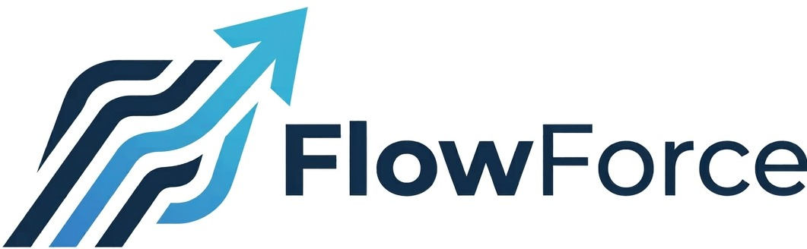

<p align="center">
  
</p>

# FlowForce I²TMS: Reimagining Intelligent Traffic Management for Indian Cities

## Executive Summary
**FlowForce** is an next-generation Integrated & Intelligent Traffic Management System (I²TMS) designed specifically for Indian urban conditions. Moving beyond traditional "enforcement-first, challan-centric" deployments, FlowForce delivers a **flow-first, emergency-priority, and predictive safety intelligence platform**. 

By processing multi-camera CCTV feeds with a fine-tuned 14-to-7 class Indian vehicle YOLO detector, ByteTrack motion tracking, Webster optimum cycle signal allocation, and dynamic Green Corridor routing via OSRM, FlowForce reduces junction delay, preempts emergency corridors, and identifies accident black-spots before crashes occur.

---

## 🏗️ 1. System Architecture & Model Pipeline

```
[ CCTV Feed / RTSP / Video ]
           │
           ▼
┌───────────────────────────┐
│   Vehicle & Ped Detector  │ ──► Fine-Tuned 14-Class YOLOv8
│   (ml/utils/detector.py)   │ ──► Mapped to 7 UI Indian Vehicle Classes
└─────────────┬─────────────┘      (Ambulance, 3-Wheeler, Bus, Car, Bike, Truck, Tractor)
              │
              ▼
┌───────────────────────────┐
│     ByteTrack Engine      │ ──► Unique Track IDs, Centroid Motion & Speed Matrix
└─────────────┬─────────────┘
              │
              ▼
┌───────────────────────────┐
│  Traffic State Engine     │ ──► Density %, PCU Calculation, Queue Length, 
│ (ml/utils/traffic_engine) │      Average Waiting Time & 0-100 Traffic Score
└─────────────┬─────────────┘
              │
      ┌───────┴─────────────────────────┐
      ▼                                 ▼
┌──────────────────────────┐  ┌───────────────────────────┐
│ Dual Emergency Detector  │  │ Dynamic Webster Signal    │
│  (Class ID + HSV Color)  │  │  Optimization & Bus TSP   │
└─────────────┬────────────┘  └─────────────┬─────────────┘
              │                             │
              ▼                             ▼
┌─────────────────────────────────────────────────────────┐
│          FastAPI Central Engine & Database API          │
│     (Green Corridor Routing, Black-Spot Analytics)      │
└─────────────────────────────┬───────────────────────────┘
                              │
                              ▼
┌─────────────────────────────────────────────────────────┐
│    FlowForce ICCC Web Command Center (React + Vite)     │
└─────────────────────────────────────────────────────────┘
```

### 1.1 Detection & Tracking Stack
- **Heterogeneous Indian Vehicle Classes**: Trained model (`best.pt`) supporting 7 key classes:
  1. `ambulance` (Emergency class)
  2. `three wheeler` (Auto-rickshaws, CNGs, manually driven rickshaws)
  3. `bus` (Public transit & private coaches)
  4. `car` (Passenger cars & minivans)
  5. `motorbike` (2-wheelers, scooters)
  6. `truck` (LVC, HVC, multi-axle freight)
  7. `tractor` (Agricultural & commercial utility vehicles)
- **Cross-Class Box Deduplication**: Custom IoU deduplication (`_dedup_cross_class`) to eliminate overlapping duplicate bounding boxes in dense Indian traffic.
- **Passenger Car Unit (PCU) Conversion**: Assigns standardized Indian PCU weights (e.g. Bus = 2.2, 3-Wheeler = 0.8, Motorbike = 0.5) to evaluate true road space occupancy rather than raw vehicle counts.

---

## 🚦 2. Signal Optimization & Emergency Preemption

### 2.1 Dynamic Webster Optimum Cycle Formula
FlowForce continuously calculates optimal signal cycle lengths ($C_{opt}$) and green splits using Webster's equation:

$$C_{opt} = \frac{1.5L + 5}{1 - Y}$$

Where:
- $L$ = Total lost time per cycle (all-red + yellow clearance time, typically 12s across 4 approaches).
- $Y = \sum_{i} \frac{q_i}{s_i}$ = Sum of critical approach flow ratios (PCU flow rate / saturation flow).
- **Transit Signal Priority (TSP)**: Automatically extends green phases by 5–10s when delayed public transit buses are detected in queue.

### 2.2 Green Corridor Preemption & Routing
- Dual-layer Emergency Verification:
  1. YOLO class identification (`ambulance`).
  2. HSV Color Profile Analysis (red/white ambulance livery verification).
- **OSRM Integration**: Dynamically calculates the fastest route from source to hospital, overriding all signal controllers along the corridor to turn Green upon vehicle approach.

---

## 📈 3. Predictive Safety & Black-Spot Analytics

- **Junction Safety Risk Score (0–100)**: Evaluated using speed variance, high queue spillback risk, and pedestrian-vehicle near-miss indices.
- **Proactive Interventions**: Automatically recommends dynamic VMS speed warnings, lane segregation for 2/3-wheelers, and phase timing adjustments.

---

## ⚙️ 4. Scalability, Cost & Retrofit Note

### 4.1 Deployment on Existing Infrastructure
- **Zero Camera Hardware Replacement**: FlowForce consumes RTSP / HTTP video streams directly from existing ANPR, RLVD, and CCTV cameras installed across Indian smart cities (e.g., Pune, Bengaluru, Nagpur).
- **Edge Resilience**: Operates in **Edge Autonomous Mode** at individual junction controllers. If network connection to the central ICCC drops, local edge controllers continue running Webster adaptive cycles independently.

### 4.2 Cost Breakdown & Efficiency
- **Hardware Savings**: ~70% reduction in deployment cost compared to proprietary hardware-locked ATCS solutions.
- **Scalability**: Microservice architecture capable of running on edge devices (NVIDIA Jetson / x86 edge servers) or containerized in city data centers.

---

## 🔒 5. Privacy & Ethics Compliance

- **No PII Collection**: FlowForce extracts vehicle bounding boxes, trajectory vectors, and counts. It does not perform driver facial recognition or store driver identity.
- **Data Minimization**: Video frames are processed in-memory for inference and immediately discarded unless logged by an operator for explicit audit purposes.
- **Standardized Audit Logging**: All emergency overrides and manual signal interventions are recorded in `audit_logs` for transparency and administrative oversight.
